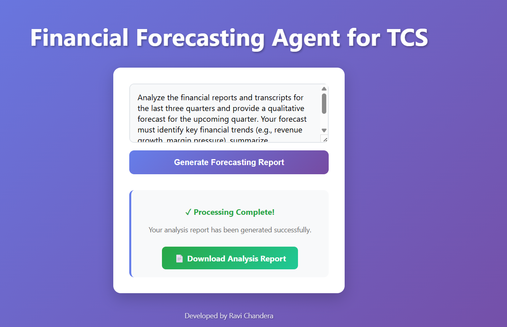

## Running Steps

1. **Clone the repository**
   ```bash
   git clone https://github.com/Ravi-chandera/finance_ai_agent.git
   ```

2. **Enter into the project directory**
   ```bash
   cd finance_ai_agent
   ```

3. **Ensure you have `venv` installed**

   - For **Windows** and **macOS/Linux**, `venv` is included with Python 3.3+.
   - If you get an error like `No module named venv`, install it:

     - **Windows**:
       - Make sure you have Python 3.3+ installed from [python.org](https://www.python.org/downloads/).
       - If using older Python, upgrade to a newer version.

     - **macOS/Linux**:
       ```bash
       python3 -m pip install --user virtualenv
       ```

4. **Create a virtual environment**

   - **Windows:**
     ```bash
     python -m venv venv
     ```
   - **macOS/Linux:**
     ```bash
     python3 -m venv venv
     ```

5. **Activate the virtual environment**

   - **Windows:**
     ```bash
     venv\Scripts\activate
     ```
   - **macOS/Linux:**
     ```bash
     source venv/bin/activate
     ```

6. **Add your API key to `config.json`**

   - Open `config.json` and insert your Google API key as shown in the file.

7. **Install dependencies**
   ```bash
   pip install -r requirements.txt
   ```

8. **Run the application**
   ```bash
   uvicorn main:app --reload
   ```

9. **Open your browser and go to:**
   ```
   http://localhost:8000/
   ```
10. Task is already inserted. Click on generate analysis report button. It will take 3 to 4 minutes. 

11. You will get button to download reports. If you do not see that button, go to **reports** folder in your code.



12. Website is not optimized so open same URL into new tab to ask again. 